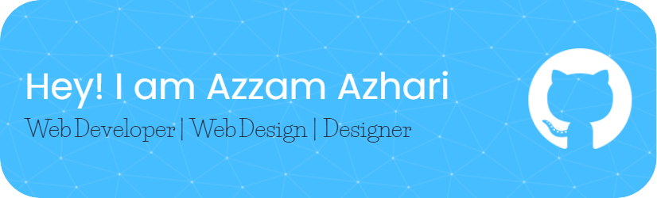

<h1 align="left">Hey 👋 What's up?</h1>

###

My name is Azzam Azhari and I'm a Frontend Web Developer, from Indonesia

###

<h2 align="left">About me</h2>

###

✨ Creating bugs since 2020 📚 I'm currently learning a React Programming 🎯 Goals: Global Class Software Dev 🎲 Fun fact: ...

###

#### Skills

<!-- 

 -->

#### Connect with me

   

#### 📊 My GitHub Stats

<!-- <h2 align="left">I code with</h2>

###

  
  
  
  
  
  
  
  

 -->

###

<picture>
  <source media="(prefers-color-scheme: dark)" srcset="https://raw.githubusercontent.com/tobiasmeyhoefer/tobiasmeyhoefer/output/github-snake-dark.svg" />
  <source media="(prefers-color-scheme: light)" srcset="https://raw.githubusercontent.com/tobiasmeyhoefer/tobiasmeyhoefer/output/github-snake.svg" />
  
</picture>
